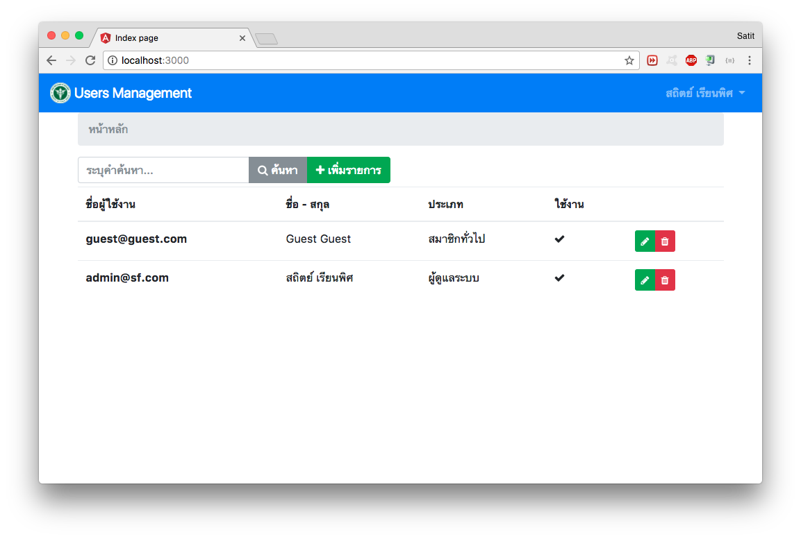
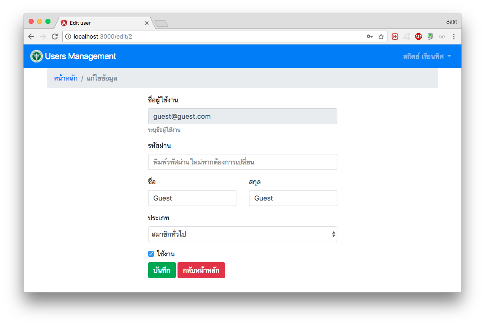
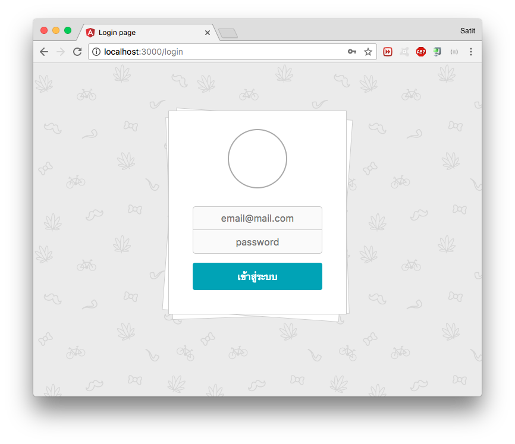

# Users Management

## Installation

```
# npm i
# npm i typescript -g
# npm i nodmeon -g
```

## MySQL Connection

Edit file `.env`

```
DB_HOST=localhost
DB_PORT=3306
DB_NAME=ums
DB_USER=mysql_user
DB_PASSWORD=mysql_password

PORT=3000
```

`PORT` = Web server port

## Compile

``` 
# tsc

or 

# tsc -w
```

## Running server

```
# nodemon
```

Web url: `http://localhost:3000`

## Database file

SQL for import: `ums.sql`

## Screenshort



